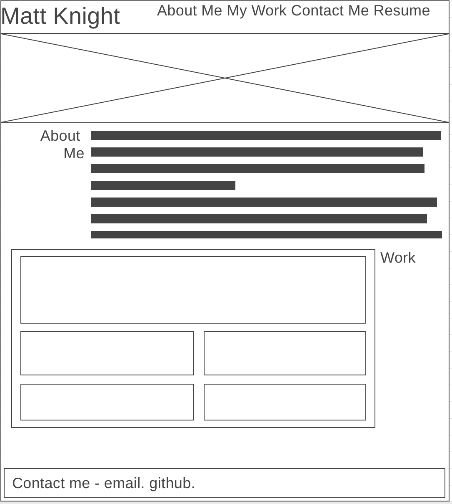
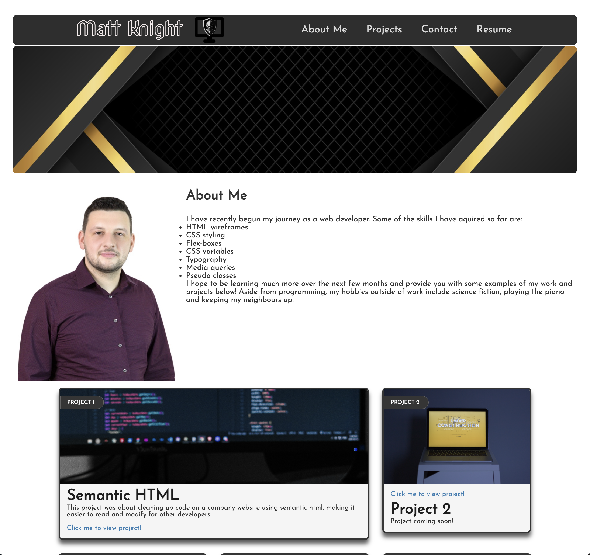
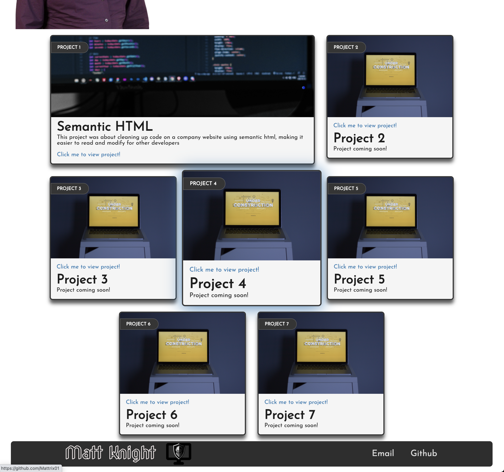

# My-Portfolio

## Description

Demonstration of my HTML and CSS skills in a responsive portfolio page for potential employers to view my work.

## GitHub Pages Link

https://github.com/Mattrix01/My-Portfolio

https://mattrix01.github.io/My-Portfolio/

## Technologies Used

- HTML
- CSS styling
- HTML structuring and wireframes
- Flex-boxes
- CSS variables
- Typography
- Media queries
- Pseudo classes

## Steps taken

- I started with drawing out my page to plan a basic HTML structure.

- Then I began to set up my header, containing a nav bar flex box, a banner and it's styling, also added a logo with a transparent background.

- I used psuedo classes to have a more responsive nav bar.

- I set up some media queries to control how my browser window resizes and how the nav bar carries across to different screens such as mobile and ipad.

- I tinkered round with banner properties till I was happy.

- I changed the font and about me container and improved the flex boxes and how they wrap around my self image.

- I continuley added some margins and so on.

- I then decided on a html structure for my new flex boxes to create some cards to contin my work.

- I styled my card around my colour scheme I chose, set up some CSS variables, also imported a google font family to improve the appearence of my site.

- I experimented with psuedo classes more and the styling of my boxes using rounded borders, shadows, a hover to enlarge the projects and create a purple shadow.

- I made sure my flexbox which was the parent for all my project cards was set up correctly as I resized my window.

- I added a footer containing links to my email and github account.

- I set up some id tags in my html so I could jump to those partically sections via the nav links.

- Finally, I had to put each of my card containers inside of an anchor tag so a user can click on my entire card and jump to the corresponding project on github.

- I only have one project, so I have a skeleton set up with a default under contruction picture and links to my github profile, untill I can replace these links with newly added repositories and projects.

## Original layout planned

## web page screenshot

