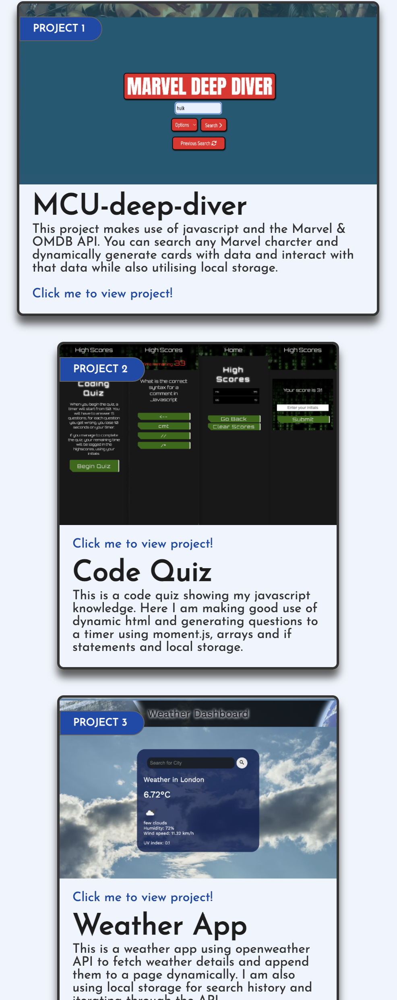

# My-Portfolio

## Description

Demonstration of my HTML and CSS skills in a responsive portfolio page for potential employers to view my work.

## GitHub Links

https://github.com/Mattrix01/My-Portfolio/tree/dev

https://mattrix01.github.io/My-Portfolio/

## Technologies Used

- HTML
- CSS styling
- HTML structuring and wireframes
- Flex-boxes
- CSS variables
- Typography
- Media queries
- Pseudo classes
- Animation

## Steps taken

- I started with drawing out my page to plan a basic HTML structure.

- Then I began to set up my header, containing a nav bar flex box, a banner and it's styling, also added a logo with a transparent background.

- I used psuedo classes to have a more responsive nav bar.

- I set up some media queries to control how my browser window resizes and how the nav bar carries across to different screens such as mobile and ipad.

- I tinkered round with banner properties till I was happy.

- I changed the font and about me container and improved the flex boxes and how they wrap around my self image.

- I continuley added some margins and so on.

- I then decided on a html structure for my new flex boxes to create some cards to contin my work.

- I styled my card around my colour scheme I chose, set up some CSS variables, also imported a google font family to improve the appearence of my site.

- I experimented with psuedo classes more and the styling of my boxes using rounded borders, shadows, a hover to enlarge the projects and create a purple shadow.

- I made sure my flexbox which was the parent for all my project cards was set up correctly as I resized my window.

- I added a footer containing links to my email and github account.

- I set up some id tags in my html so I could jump to those partically sections via the nav links.

- I had to put each of my card containers inside of an anchor tag so a user can click on my entire card and jump to the corresponding project on github.

- From here I used my new skills developed from progressing through the course to improve my portfolio page using further HTML and CSS skills aquired.

- I made my cards more responsive using media queries

- I created a new transparent logo and added a new nav bar with styling

- I added top section making good use of positioning and CSS with some links to my github etc, as well as an image fo me with some new colour and theme styling appleid throughtout page using CSS variables, aswell as some mouse over effects on my page and logo

- I had a lot of trouble-shooting for overlaying images and fitting them into place but I got them all solved in the end and maintained a responsive web document for mobile phone devices.

- I did further styling and tweaks throughout the page, including adding some fade and margin animations.

- I re-linked all my pages and href's so some open in another tab for usability.

- I added my new projects to my cards effectively.

- Finally, updated my README document and cleaned out any old files, sorted any more responsive issues and bugs (which tend to happen a lot!)

## web page screenshot

## Original layout plan (Later changed on the fly as I got creative)

